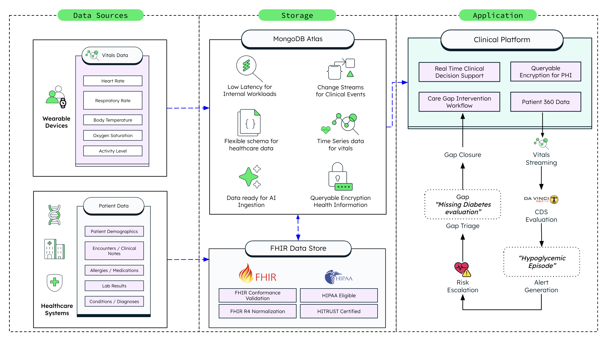

# Care Gaps with Clinical Decision Support


A Solution that demonstrates how MongoDB Atlas powers real-time clinical decision support (CDS) on top of a FHIR data foundation. The platform targets a real operational gap: organizations using FHIR data lakes like AWS Healthlake for interoperability hit hard limits when they try to run real-time clinical workflows against the same store — high latency, poor nested query performance, no native time-series support, and unpredictable costs. MongoDB Atlas fills that operational gap.

## Architecture



The platform uses a dual-layer persistence model:

| Layer | Store | Purpose |
|---|---|---|
| **Layer A — FHIR Exchange** | FHIR Data Store / `synthetic_patients` | Canonical FHIR R4 bundles for interoperability and compliance |
| **Layer B — CDS Operational** | MongoDB Atlas / `patient_360` | Denormalized patient documents optimized for point-of-care queries |

Wearable device vitals stream directly into a MongoDB Time Series collection (`synthetic_vitals`). Patient clinical data enters through the FHIR store and is materialized into MongoDB Atlas as a denormalized `patient_360` document. MongoDB then powers the real-time CDS engine, care gap workflows, embedded Atlas Charts, and queryable encryption for PHI protection.

---

## Prerequisites

### Docker

Install [Docker Desktop](https://www.docker.com/products/docker-desktop/) to run the platform as containers.

### MongoDB Atlas

This platform requires a MongoDB Atlas cluster (M10 or higher) for the operational data layer, Atlas Search, and Time Series collections.

1. Sign up or log in at [MongoDB Atlas](https://www.mongodb.com/atlas).
2. Create a new project or select an existing one.
3. Click **Create a New Database** and choose the **M10** tier.
4. Configure cluster settings and click **Finish and Close**.
5. Go to **Network Access** and add your IP address to the allowlist.
6. Click **Connect** on your cluster, select **Connect your application**, and copy the connection string. You will use this as `MONGODB_URI`.

### AWS Account (Optional)

An AWS account with Healthlake access is only required if you want to persist patient FHIR bundles in Healthlake. By default, all FHIR bundles are stored in MongoDB.

---

## Quick Start

### 1. Clone the Repository

```bash
git clone <repository-url>
cd healthcare-clinical-platform
```

### 2. Configure Environment Variables

Create a `.env` file in the root of the project:

```env
NEXT_PUBLIC_API_URL="http://localhost:8000"
MONGODB_URI="mongodb+srv://<USER>:<PASSWORD>@<HOSTNAME>/?retryWrites=true"
DATABASE_NAME="hc_clinical_platform"
APP_NAME="<ATLAS_APP_NAME>"
HEALTHLAKE_DATASTORE_ID="<AWS_HEALTHLAKE_ID>"
AWS_REGION="<AWS_REGION>"
AWS_PROFILE="<AWS_PROFILE>"
QE_ENABLED=true
```

| Variable | Description |
|---|---|
| `NEXT_PUBLIC_API_URL` | Backend API URL the frontend calls |
| `MONGODB_URI` | Atlas connection string |
| `DATABASE_NAME` | Atlas database name |
| `APP_NAME` | Atlas App Services application name |
| `HEALTHLAKE_DATASTORE_ID` | AWS Healthlake datastore ID (optional) |
| `AWS_REGION` | AWS region for Healthlake (optional) |
| `AWS_PROFILE` | AWS CLI profile name (optional) |
| `QE_ENABLED` | Enable MongoDB Queryable Encryption (`true` / `false`) |

### 3. Deploy with Docker Compose

```bash
docker compose up --build
```

This starts two containers:

| Container | Port | Description |
|---|---|---|
| `cds-backend-container` | `8000` | FastAPI backend |
| `cds-frontend-container` | `8080` | Next.js frontend |

Open [http://localhost:8080](http://localhost:8080) in your browser.

---

## Data Seeding

The platform provides two demo personas at login.

### Frida — Simulation Mode

Select Frida to configure simulation settings before seeding. The platform runs a 9-step pipeline that generates and loads all data automatically:

1. Generate synthetic FHIR R4 patient bundles into `synthetic_patients`
2. Generate 24-hour vitals histories per patient into `synthetic_vitals` (Time Series collection)
3. Materialize FHIR bundles into denormalized `patient_360` documents
4. Seed 5 CDS rule definitions
5. Compute per-patient personalized thresholds (e.g., HR threshold 90 for beta-blocker patients)
6. Evaluate CDS rules against current vitals and generate clinical alerts
7. Compute HEDIS care gaps for 5 measures per patient and write results to `patient_360`
8. Seed provider-patient attribution relationships
9. Start the real-time SSE vitals simulation worker

### Default Persona — Existing Data Mode

Select the default persona to connect to a previously seeded dataset with no simulation running. Use this mode when you want to demonstrate the platform against stable data or when the seeding pipeline has already run.

---

## Using the Application

### Dashboard

The dashboard surfaces patient risk aggregations and HEDIS measure data powered by an Atlas aggregation pipeline. The patient list is prioritized by risk score, factoring in clinical conditions, real-time vitals, medications, and open care gaps. Click **View MongoDB Pipeline** to inspect the live aggregation query.

### Patient Detail

Click any patient to open the Patient Detail view.

- **Primary Concern** shows the most clinically significant condition. Click it to retrieve a CDS Hook card with actionable recommendations.
- **Clinical Pressure** displays vital signs breaching personalized thresholds.
- **Escalation Drivers** synthesize active alerts and open care gaps into a single priority ranking.
- **Vitals Chart** streams live data from the wearable patch simulation. Watch deteriorating patterns trigger new alerts in real time, powered by MongoDB's native Time Series collection.

### Intervention Workflows

Click **Open Patient Chart** to view open care gaps and start an intervention workflow.

1. Select a care gap (e.g., CDC-HBA — Comprehensive Diabetes Care HbA1c Testing).
2. Order labs within the workflow.
3. Record results by selecting a simulated outcome: **Controlled**, **Elevated**, or **Concerning**.
4. Generate an automated Clinician Review Summary.

All workflow state is written to the same `patient_360` MongoDB document — no separate tables, no joins, no schema migrations.

### Care Gaps Tab

The Care Gaps tab embeds an Atlas Charts dashboard directly in the application. Population-level metrics include Top Firing CDS Rules, Gap Status by HEDIS Measure, and HEDIS Compliance Rate by Measure. The charts query the live `patient_360` collection so they reflect current data without any ETL pipeline.

---

## Key MongoDB Features

### Flexible Document Model

The `patient_360` document collapses what would be dozens of FHIR resource lookups into a single sub-millisecond read. Demographics, conditions, medications, labs, vitals summary, care gaps, alerts, personalized thresholds, and intervention workflows all coexist in one document with no joins required.

### Native Time Series Collections

`synthetic_vitals` is a MongoDB Time Series collection built for wearable telemetry. Automatic bucketing, compressed storage, and range queries over timestamp and patient ID enable efficient trend analysis and deterioration detection that a FHIR data lake cannot support.

### Aggregation Pipeline

- **Dashboard patient list:** multi-patient aggregation with alert counts, care gap status, and vitals summaries in one round-trip.
- **Care gap computation:** HEDIS logic backed by indexed queries on conditions, medications, and lab codes.
- **Vitals trend analysis:** time-bucketed aggregations over `synthetic_vitals` for 2-hour baselines and 4-hour deterioration trends.

### Schema Flexibility at Runtime

KED and CDC-HBA intervention workflows have different shapes — different order fields, different evidence structures — yet both coexist inside the same `patient_360.interventions` array. No migrations are required as new workflow types are added.

### Embedded Analytics with Atlas Charts

Atlas Charts are embedded directly inside the application. Population-level metrics are served from the same Atlas cluster that powers the operational workload, with no separate BI tool, no data export, and no ETL pipeline.

### Queryable Encryption for PHI Protection

MongoDB Queryable Encryption lets the platform run queries directly on encrypted fields without decrypting them on the server. Encryption keys never leave the client. Even if the database server or application layer were compromised, patient data remains unreadable. This demonstrates that CDS workloads do not require a tradeoff between query performance and data protection — a critical capability for any production healthcare deployment.

### Operational Separation from the FHIR Layer

MongoDB Atlas sits alongside AWS Healthlake, not instead of it. FHIR remains the canonical interoperability and exchange format. MongoDB powers the derived, denormalized operational views that care coordinators query at the point of care. This dual-layer pattern is how modern health systems scale CDS without compromising FHIR compliance.

### Predictable Cost Model

AWS Healthlake charges per FHIR read, search query, data import, and export operation. A CDS workload running continuous alert evaluation, care gap computation, and vitals trend queries against Healthlake generates costs that scale directly with clinical activity. MongoDB Atlas uses tiered infrastructure pricing — the cluster size determines the cost, not the query volume. For organizations operating under tight budget cycles and value based care contracts, this cost predictability is a requirement for sustainable operations.

---

## Clinical Decision Support Engines

### Alert Engine (Real-Time Monitoring)

The Alert Engine evaluates patient vitals against CDS rules to generate clinical alerts with personalized thresholds, sustained-breach detection, 2-hour baseline calculations, and 4-hour trend analysis.

| Rule | Trigger |
|---|---|
| Beta-Blocker Aware Tachycardia | HR above personalized threshold (90 for beta-blocker patients vs. 100 default) |
| Multi-Factor Hypoglycemia | HR spike >20% above 2-hour baseline + T2DM + insulin + age 65 or older + low activity |
| CKD Metabolic Acidosis | RR >22 sustained >30 min + CKD + T2DM + increasing 4-hour trend |
| Sepsis Warning | 3 or more of 4 modified SIRS criteria + T2DM + age 65 or older |
| Comparative Context | Same vital reading produces different severity based on patient context |

### Quality Engine (HEDIS Care Gaps)

The Quality Engine evaluates patient clinical histories against HEDIS measures targeting the Type 2 Diabetes and CKD cohort.

| Measure | Code | Frequency |
|---|---|---|
| Comprehensive Diabetes Care — HbA1c Testing | CDC-HBA | 180 days |
| Kidney Health Evaluation for Diabetes | KED | 365 days |
| Controlling High Blood Pressure — Diabetes Subset | CBP | 365 days |
| Statin Therapy for Patients with Diabetes | SPD | 365 days |
| Eye Exam for Patients with Diabetes | EED | 365 days |

Each care gap output includes structured evidence (found and missing), a recommended action, measurement period, last completed date, confidence level, and a priority score escalated by overdue days and clinical trends.

---

## Project Structure

```
healthcare-clinical-platform/
├── backend/
│   ├── main.py                        # FastAPI app and router registration
│   ├── cds/
│   │   ├── alert_engine.py            # Real-time threshold monitoring
│   │   ├── quality_engine.py          # HEDIS care gap computation
│   │   ├── hedis_measures.py          # 5 HEDIS measure definitions
│   │   ├── rules_seed.py              # CDS rule definitions
│   │   ├── service.py                 # CDS facade
│   │   └── repository.py             # MongoDB operations for CDS
│   ├── materializer/                  # FHIR to patient_360 transformation
│   ├── synthetic/                     # FHIR bundle generator and vitals simulator
│   ├── attribution/                   # Provider-patient attribution
│   ├── fhir/                          # DEQM-aligned /fhir/Measure/$care-gaps endpoint
│   ├── hooks/                         # CDS Hooks card generation
│   ├── dashboard/                     # Dashboard aggregation
│   ├── interventions/                 # KED and CDC-HBA workflows
│   └── simulation/                    # SSE real-time vitals worker
└── frontend/
    ├── components/
    │   ├── login/                     # Login modal and 9-step seeding pipeline
    │   ├── dashboard/                 # Clinician dashboard
    │   ├── patients/                  # Patient detail, care gaps, intervention workspaces
    │   └── mongodb/                   # Data model toggle and document evolution views
    └── lib/
        ├── api.ts                     # API client
        ├── mock-data.ts               # TypeScript interfaces
        └── demo-context.tsx           # Demo state management
```

---

## Resources

- [MongoDB Atlas](https://www.mongodb.com/atlas)
- [MongoDB Time Series Collections](https://www.mongodb.com/docs/manual/core/timeseries-collections/)
- [MongoDB Queryable Encryption](https://www.mongodb.com/docs/manual/core/queryable-encryption/)
- [Atlas Charts](https://www.mongodb.com/products/charts)
- [HL7 FHIR R4](https://hl7.org/fhir/R4/)
- [HEDIS Measures — NCQA](https://www.ncqa.org/hedis/)

## License

This project is licensed under the MIT License - see the [LICENSE](LICENSE) file for details.